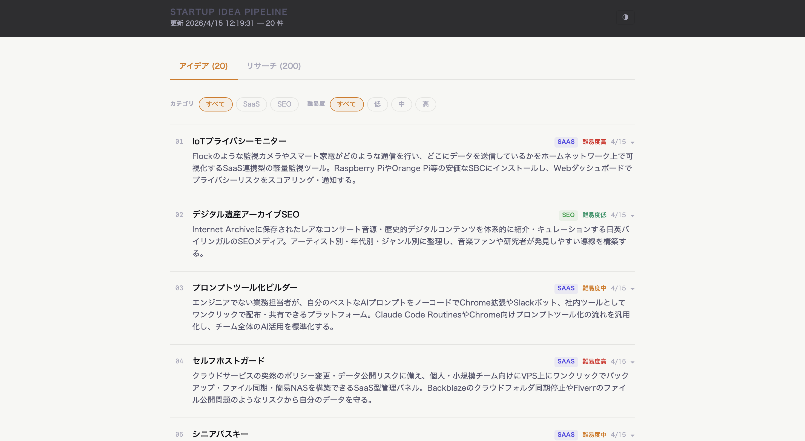

# Startup Idea Pipeline

スタートアップアイデアを自動収集・生成し、ブラウザで閲覧できるパイプライン。  
GitHub Actions が 12 時間ごとに市場調査を行い、Claude API でアイデアを生成。高スコアのアイデアは毎日 AI エージェントが会議形式で評価し、採用されたものを GitHub Issue として記録する。結果を GitHub Pages でリアルタイム公開する。



## 概要

一人法人・個人開発者向けに、IT/SaaS・SEO 領域のスタートアップアイデアを継続的に提供するシステム。  
手動でトレンドを追う手間をなくし、毎日新しいアイデアのリストをダッシュボードで確認できる。

## 機能

- **自動市場調査** — Hacker News・Reddit (r/SaaS, r/SEO, r/startups)・TechCrunch RSS から最新トレンドを収集
- **AI アイデア生成** — Claude Opus 4.6 が市場データをもとにスタートアップアイデアを 3〜5 件/回 生成
- **日本語出力** — タイトル・説明・ターゲット市場・Why Now・収益モデルをすべて日本語で生成
- **SQLite 永続化** — アイデアとリサーチデータを DB に蓄積。重複なし、7 日より古いリサーチは自動削除
- **AI エージェント会議** — eval_total ≥ 7.0 の高スコアアイデアを毎日 JST 9:00 に自動開催。CEO・企画・営業・マーケティング・開発・運用の 6 エージェントが議論し採否を判断
- **GitHub Issue 自動作成** — 「採用」と判断されたアイデアは会議録とともに GitHub Issue として自動登録
- **ダッシュボード** — React + Vite + TailwindCSS 製 SPA。カテゴリ・難易度フィルタ、ページネーション付き
- **Why Now ハイライト** — 展開すると「なぜ今か」をアンバー色で強調表示
- **ダーク/ライトモード切替** — ヘッダーのボタンで即時切替

## アーキテクチャ

```
GitHub Actions (cron: 毎日 JST 6:00) — pipeline.yml
  └── 1. 市場調査 (HN API / Reddit JSON / TechCrunch RSS)
  └── 2. Claude API でアイデア生成 (claude-opus-4-6)
  └── 3. SQLite に保存 → JSON エクスポート
  └── 4. data/ideas.db + docs/data/*.json を git push
             └── GitHub Pages が自動更新 (deploy.yml)

GitHub Actions (cron: 毎日 JST 9:00) — meeting.yml
  └── 1. eval_total ≥ 7.0 の未討議アイデアを最大 3 件取得
  └── 2. CEO・企画・営業・マーケ・開発・運用の 6 エージェントが議論
  └── 3. CEO が採否を判断 → 採用なら GitHub Issue を自動作成
  └── 4. data/ideas.db + docs/data/meetings.json を git push
             └── GitHub Pages が自動更新 (deploy.yml)
```

```
idea-pipeline/
├── .github/workflows/
│   ├── pipeline.yml   # 12 時間ごとの収集・生成ワークフロー
│   ├── meeting.yml    # 毎日 JST 9:00 の AI エージェント会議
│   └── deploy.yml     # GitHub Pages デプロイ (main push 時)
├── pipeline/
│   ├── db.py          # SQLite CRUD
│   ├── research.py    # HN / Reddit / RSS 取得
│   ├── ideation.py    # Claude API 呼び出し
│   ├── export.py      # DB → JSON
│   └── main.py        # エントリポイント
├── meeting/
│   ├── agents.py      # エージェント定義・Claude API 呼び出し
│   ├── db.py          # 会議セッション・発言の CRUD
│   ├── export.py      # DB → meetings.json
│   ├── github_issue.py# GitHub Issue 作成
│   └── main.py        # 会議オーケストレーション
├── .claude/agents/    # エージェントペルソナ定義 (ceo / planning / sales 等)
├── src/               # React ダッシュボード (Vite + TypeScript + Tailwind)
│   ├── App.tsx
│   └── components/    # IdeaCard / FilterBar / Pagination / ResearchTable / MeetingTab
├── docs/data/
│   ├── ideas.json     # 自動生成 (GitHub Pages で配信)
│   ├── research.json
│   └── meetings.json  # 会議録 (GitHub Pages で配信)
└── data/ideas.db      # SQLite DB (リポジトリで管理)
```

## セットアップ

### 1. GitHub Secrets の設定

リポジトリの **Settings → Secrets and variables → Actions** で以下を追加:

| Secret 名 | 値 |
|---|---|
| `ANTHROPIC_API_KEY` | Anthropic API キー |

### 2. GitHub Pages の有効化

**Settings → Pages → Source** を **GitHub Actions** に設定。

### 3. 手動実行（初回確認）

**Actions タブ → Idea Pipeline → Run workflow** でパイプラインを即時実行できる。  
**Actions タブ → Idea Evaluation Meeting → Run workflow** で会議を即時実行できる。  
**Actions タブ → Deploy to GitHub Pages → Run workflow** でデプロイを即時実行できる。

## ローカル開発

```bash
# Python パイプライン
python -m venv .venv && source .venv/bin/activate
pip install -r requirements.txt

# テスト
pytest tests/ -v

# パイプライン実行 (要 API キー)
ANTHROPIC_API_KEY=sk-ant-... python -m pipeline.main

# ダッシュボード開発サーバー
npm install
npm run dev   # → http://localhost:5173/idea-pipeline/
```

## 閲覧

ダッシュボード: [https://takuyasuenaga.github.io/idea-pipeline/](https://takuyasuenaga.github.io/idea-pipeline/)

| タブ | 内容 |
|---|---|
| アイデア | 生成されたスタートアップアイデア一覧。カテゴリ (SaaS / SEO) と難易度でフィルタ可能 |
| リサーチ | 収集した市場調査データ (ソース・タイトル・スコア・取得日) |
| 会議 | AI エージェント会議の生の発言ログ。採否バッジ・GitHub Issue リンク付き |

## 技術スタック

| 領域 | 技術 |
|---|---|
| パイプライン | Python 3.12, anthropic SDK, requests, feedparser |
| DB | SQLite |
| フロントエンド | React 18, Vite 5, TypeScript, TailwindCSS 3 |
| CI/CD | GitHub Actions |
| ホスティング | GitHub Pages |
